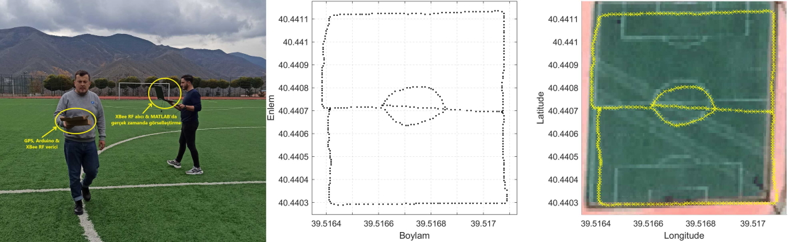

<h2>SPARKFUN TINY GPS</h2>

<h3>GPS Verisinin Bilgisayara Transferi ve Gerçek-Zamanlı Görüntülenmesi (MATLAB)</h3>
<p align="justify">Bu projede <a href="https://www.sparkfun.com/products/retired/13199">SparkFun (SF) GPS Modülünü</a> kullanıyoruz [1]. Arduino Shield ile geldiğinden direk üstten Arduino Uno'ya bağlanabiliyor. <b>TinyGPS</b> kütüphanesi <a href="https://github.com/mikalhart/TinyGPS">Mikal Hart TinyGPS GitHub repo</a> kullanarak Arduino'ya transfer edilen enlem ve boylam verisini bilgisayara okuduk [2-4]. Gümüşhane Üniversitesi Stadyumu'nda yapılan bir yürüyüşün verisinin gerçek zamanda MATLAB'da görselleştirilmesini (<b>sparkfun_tiny_gps.m</b>) izlemek için aşağıdaki resme tıklayın.</p>

[](https://www.youtube.com/watch?v=dK4XJg6-qIM)

<h3>GPS Verisinin Bilgisayara Transferi ve Gerçek-Zamanlı Görüntülenmesi (PYTHON)</h3>

<p align="justify">Python'da bu işi yapabilmek için ilk önce <b>Anaconda</b> ortamında <b>gps</b> isimli bir sanal ortam oluşturalım.</p>

```
conda create --name gps
conda activate opencv
```

<p align="justify">Ardından da aktif hâle getidiğimiz bu sanal ortama aşağıdaki paketleri yükleyelim.</p>

```
conda install pip
pip install numpy
pip install matplotlib
pip install pandas
pip install keyboard
pip install pyserial
```

<p align="justify">Sonrasında Arduino ve SF Tiny GPS modülü bağlantılarını yaptıktan sonra VS Code içinde mutlaka <b>gps</b> isimli sanal ortamı seçerek <b>sparkfun_tiny_gps.py</b> kodunu çalıştırarak veri toplayalım. Sparkfun Tiny GPS modül ile ilgili bütün bilgileri ve resimleri yukarıdaki <b>document</b> klasörünün içindeki örnek raporda bulabilirsiniz. Aşağıdaki resime tıklayarak 6 Mayıs 2025 Salı günü EEM 216 dersinde yaptığımız SF Tiny GPS deneyinin <a href="https://youtu.be/qhLhj4XStyc">videosunu</a> izleyebilirsiniz.</p>

<a href="https://youtu.be/qhLhj4XStyc"></a>

<h3>Referanslar</h3>
<ol>
    <li align="justify">SparkFun GPS Modülü | https://www.sparkfun.com/products/retired/13199</li>
    <li align="left">Mikal Hart tarafından geliştirilen TinyGPS kütüphanesi | http://arduiniana.org/2013/09/greater-accuracy-with-tinygps-13/</li>
    <li align="left">Mikal Hart tarafından geliştirilen TinyGPS kütüphanesi GitHub sayfası | https://github.com/mikalhart/TinyGPS</li>
    <li align="left">Mikal Hart tarafından geliştirilen TinyGPS+ kütüphanesi GitHub sayfası | https://github.com/mikalhart/TinyGPSPlus</li>
</ol>